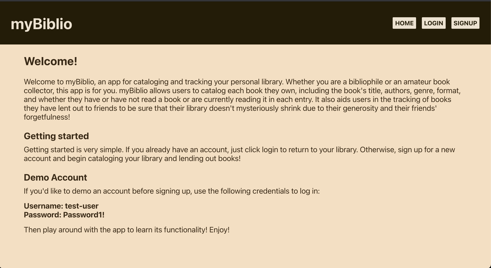
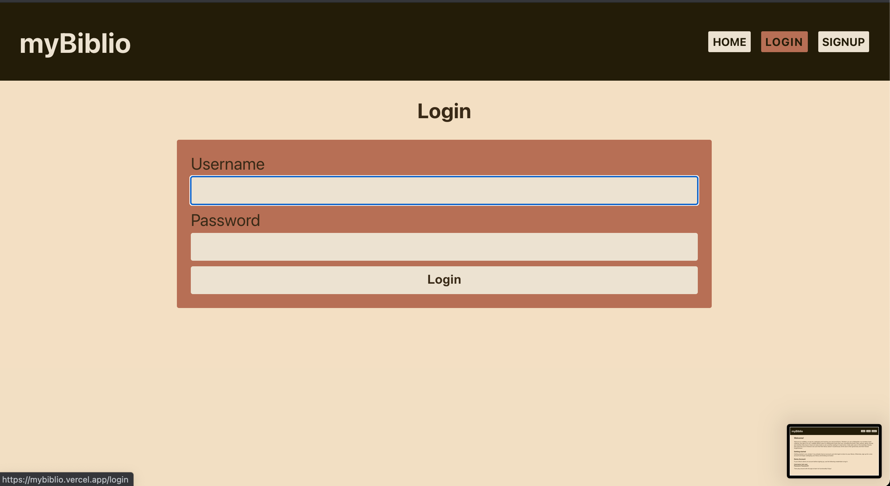
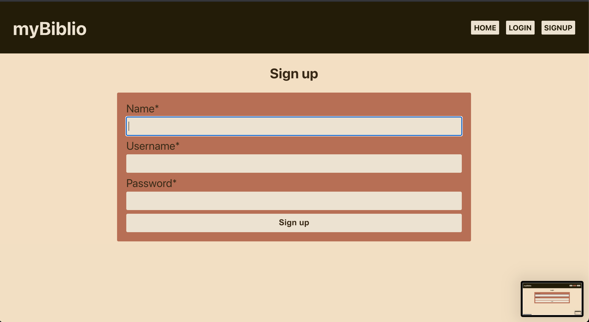
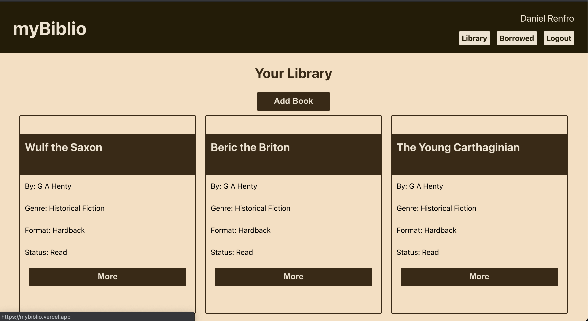
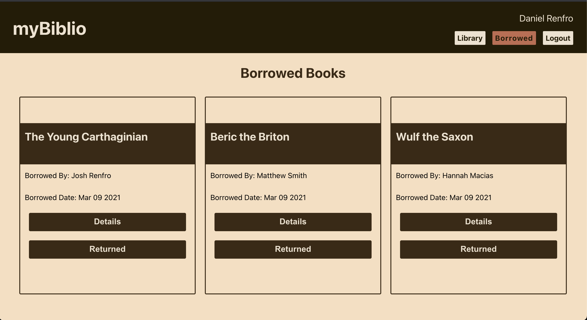

# myBiblio Client

[Live app](https://mybiblio.vercel.app/)

[Server-side repo](https://github.com/danieljrenfro/my-biblio-api)

## Purpose of the App
myBiblio is an app created for the purpose of cataloging your personal library and keeping track of books that you have lent to friends! User may add books to their library, edit books, delete books, see all of their library in one spot as well as see all borrowed books in one spot.

***

## Tour of the App

### Home Page

***

### Login Page

***

### Registration Page

***

### Library Page

***

### Borrowed Page

## Technology Used

### Backend
* Node.js
* PostgreSQL
* Express

### Frontend
* React
* Javascript
* HTML
* CSS